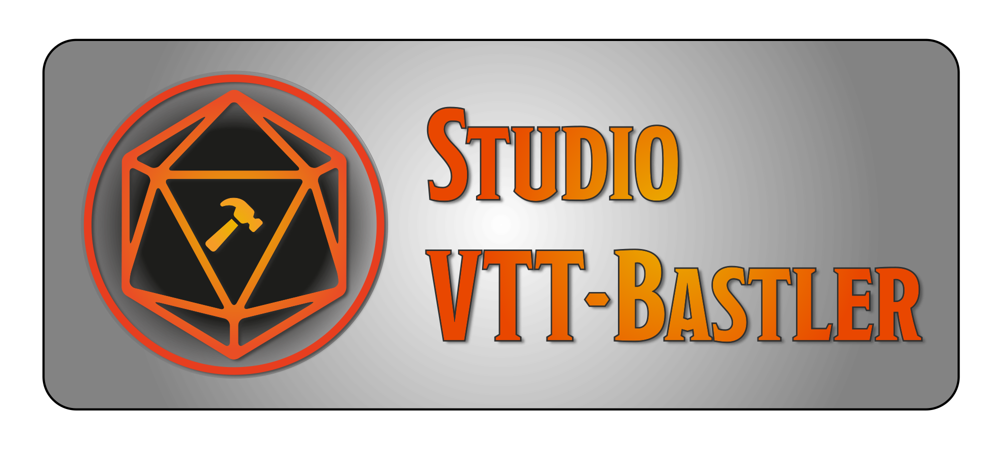

Hallo und willkommen im Github Repository vom Studio VTT Bastler.
Hier kannst du Issues für unsere Module erstellen. Wenn dir also Fehler auffallen oder du Verbesserungsvorschläge hast, lasst uns gerne ein Issue da.

## Wer sind wir?
Wir sind ein Team aus Foundry-Bastlern, die sich zusammen finden, um VTT-Projekte umzusetzen. Der Fokus liegt primär auf DAS-Modulen, wobei wir nicht ausschließen auch andere Dinge umzusetzen.

### Das Kernteam
Sir Gawain (malt in bunt und gibt kluge Ratschläge)
Paladose (kann schreiben, macht das auch)
VTTom (irgendwas mit Technik, versteht das aber oft selbst nicht)

## Was machen wir?
Wir suchen uns coole Ideen für ein Foundry-Modul und setzen dies dann um. Dabei steht für uns das Motto _Es muss Spaß machen_ im Vordergrund.
